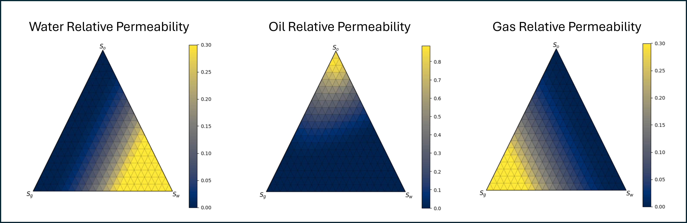

# Reservoir Rock & Fluid Property Correlations

> **If you use this repository in a paper or public work, please cite it.**
>
> Suggested citation (modify to match journal style):
>
> **Shiriyev, J.**, *Reservoir Fluid & Rock Correlations (respy)* (GitHub repository), 2025. [https://github.com/jshiriyev](https://github.com/jshiriyev)

---

## Summary

`respy` is a compact, well-documented collection of empirical and semi-empirical correlations for reservoir rock and fluid properties. Given basic fluid descriptors such as specific gravity and temperature, the package returns primary fluid properties (e.g., viscosity, formation volume factor, solution gas-oil ratio, gas Z-factor, compressibility) across a grid of pressures and saturations. These properties are commonly used in PVT screening studies, nodal analysis, material balance calculations, and reservoir simulation.

Key features:

* Modular correlation functions for oil, gas, water, rock, capillary pressure, and relative permeability.
* Vectorised operations — works with `numpy` arrays and `pandas` series/dataframes.
* Utilities to quickly generate PVT tables and plots.
* Small and dependency-light (numpy, pandas, matplotlib).

---

## Installation

```bash
git clone https://github.com/jshiriyev/reservoir-properties.git
cd reservoir-properties
python -m venv .venv
source .venv/bin/activate      # macOS / Linux
.venv\Scripts\activate       # Windows (PowerShell)
pip install -r requirements.txt
pip install -e .
```

Requirements: `python>=3.9`, `numpy`, `pandas`, `matplotlib`, `scipy`

---

## Quick start — simple examples

### Gas properties example

```python
import numpy as np
import matplotlib.pyplot as plt
from respy import phaseg

sg = 0.65  # specific gravity
temp_C = 50.0
pressures = np.linspace(1e5, 6e6, 200)

z = phaseg.z_factor(pressures, temp_C, sg)

plt.plot(pressures, z)
plt.xlabel('Pressure (Pa)')
plt.ylabel('z-factor')
plt.title('Gas z-factor vs Pressure')
plt.grid(True)
plt.show()
```

### Oil properties example

```python
import numpy as np
from respy import phaseo

sg_gas = 0.65
api = 34.0
T_C = 60.0
pressures = np.linspace(1e5, 4e7, 100)

pvt = phaseo.generate_pvt_table(pressures, api=api, sg_gas=sg_gas, temp_C=T_C)
print(pvt.head())
```

---

## Package structure

```
respy
├── capip   # capillary pressure models
├── phaseg  # gas properties
├── phaseo  # oil properties
├── rperm   # relative permeability models
└── phasew  # water properties
```

---

## Sample plots

See `examples/` for scripts that generate typical plots, such as:

* Gas compressibility factor vs reduced pressure & temperature.
* Oil viscosity vs pressure.
* Formation volume factor vs pressure.
* Relative permeability vs. saturation ternary plots



---

## API overview

* `capip` — capillary pressure correlations.
* `phaseg` — gas correlations and z-factor.
* `phaseo` — oil correlations: Rs, Bo, muo, bubble-point, compressibility.
* `rperm` — relative permeability models.
* `phasew` — brine properties and water viscosity/salinity models.

---

## Testing

```bash
pytest tests/
```

---

## Contribution

1. Fork the repo.
2. Add the function with documentation.
3. Include tests and examples.
4. Submit a PR with source/reference.

---

## License

MIT License — see `LICENSE`.

---

## Contact & Citation

* **Javid Shiriyev** — [shiriyevcavid@gmail.com](mailto:shiriyevcavid@gmail.com)
* LinkedIn: [https://www.linkedin.com/in/jshiriyev/](https://www.linkedin.com/in/jshiriyev/)
